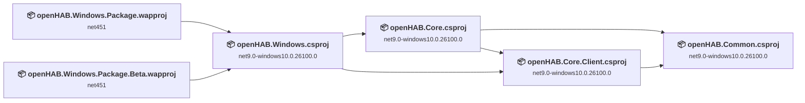
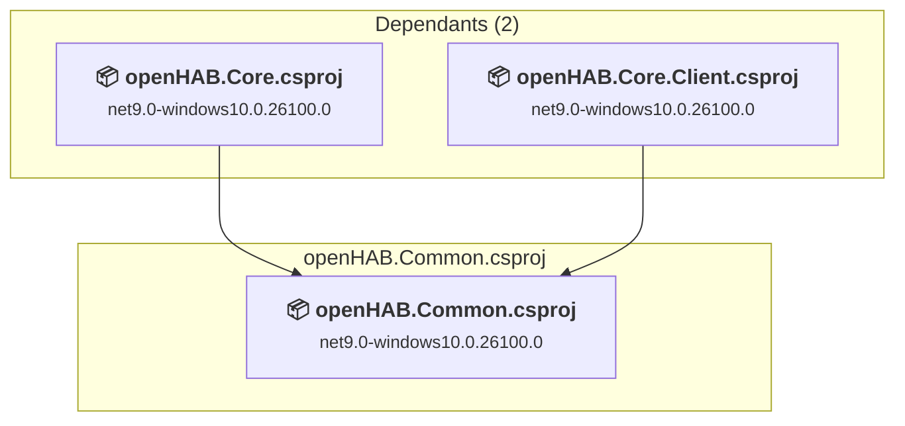
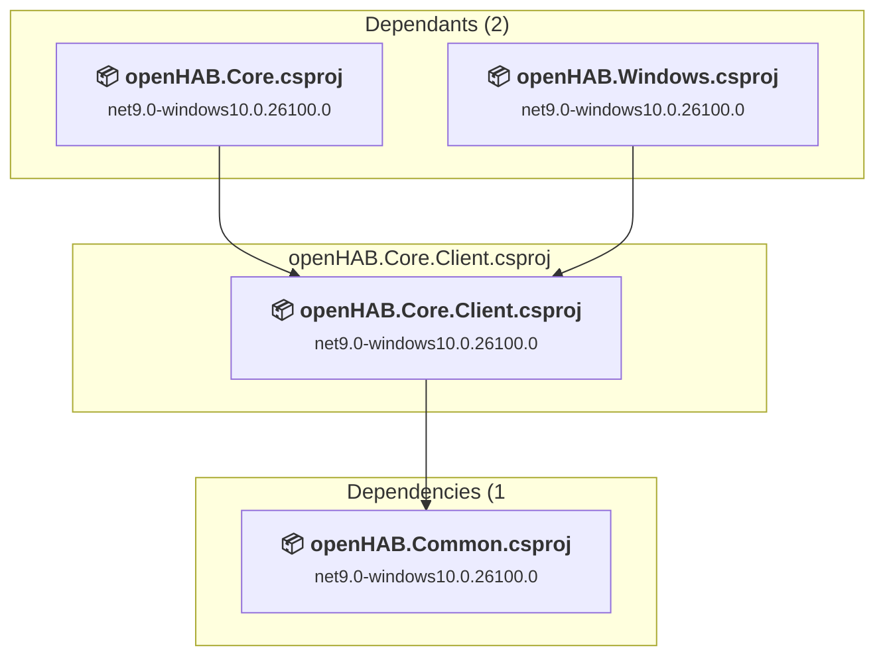
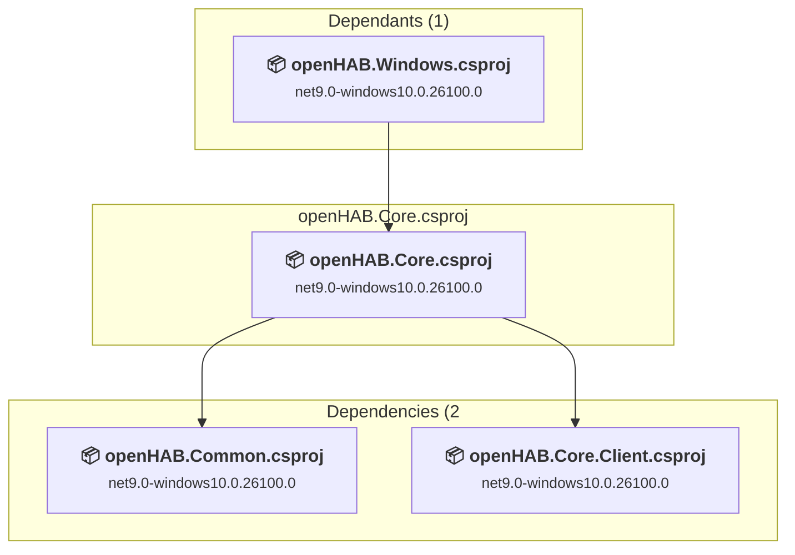
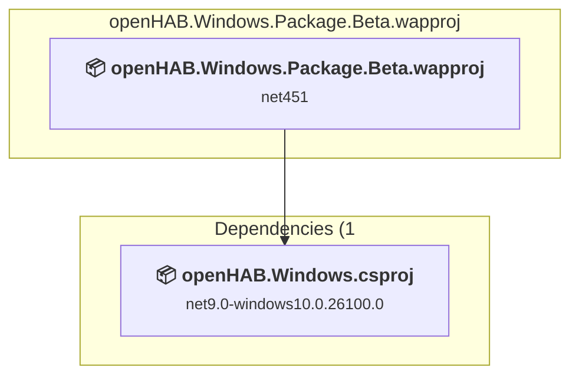
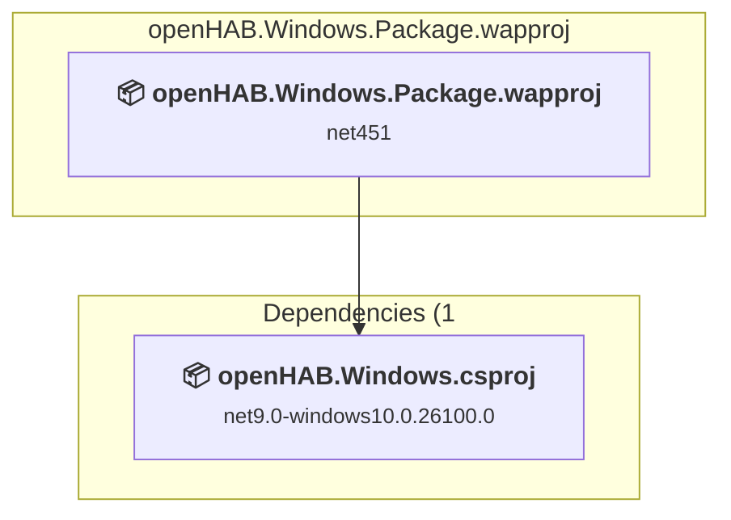
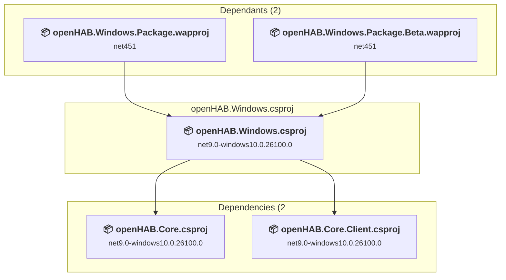

# Projects and dependencies analysis

This document provides a comprehensive overview of the projects and their dependencies in the context of upgrading to .NETCoreApp,Version=v10.0.

## Table of Contents

- [Executive Summary](#executive-Summary)
  - [Highlevel Metrics](#highlevel-metrics)
  - [Projects Compatibility](#projects-compatibility)
  - [Package Compatibility](#package-compatibility)
  - [API Compatibility](#api-compatibility)
  - [Binding Redirect Configuration](#binding-redirect-configuration)
- [Aggregate NuGet packages details](#aggregate-nuget-packages-details)
- [Top API Migration Challenges](#top-api-migration-challenges)
  - [Technologies and Features](#technologies-and-features)
  - [Most Frequent API Issues](#most-frequent-api-issues)
- [Projects Relationship Graph](#projects-relationship-graph)
- [Project Details](#project-details)

  - [src\openHAB.Common\openHAB.Common.csproj](#srcopenhabcommonopenhabcommoncsproj)
  - [src\openHAB.Core.Client\openHAB.Core.Client.csproj](#srcopenhabcoreclientopenhabcoreclientcsproj)
  - [src\openHAB.Core\openHAB.Core.csproj](#srcopenhabcoreopenhabcorecsproj)
  - [src\openHAB.Windows.Package.Beta\openHAB.Windows.Package.Beta.wapproj](#srcopenhabwindowspackagebetaopenhabwindowspackagebetawapproj)
  - [src\openHAB.Windows.Package\openHAB.Windows.Package.wapproj](#srcopenhabwindowspackageopenhabwindowspackagewapproj)
  - [src\openHAB.Windows\openHAB.Windows.csproj](#srcopenhabwindowsopenhabwindowscsproj)

## Executive Summary

### Highlevel Metrics

| Metric | Count | Status |
| :--- | :---: | :--- |
| Total Projects | 6 | All require upgrade |
| Total NuGet Packages | 22 | 2 need upgrade |
| Total Code Files | 142 |  |
| Total Code Files with Incidents | 57 |  |
| Total Lines of Code | 11522 |  |
| Total Number of Issues | 271 |  |
| Estimated LOC to modify | 261+ | at least 2.3% of codebase |

### Projects Compatibility

| Project | Target Framework | Difficulty | Package Issues | API Issues | Binding Issues | Est. LOC Impact | Description |
| :--- | :---: | :---: | :---: | :---: | :---: | :---: | :--- |
| [src\openHAB.Common\openHAB.Common.csproj](#srcopenhabcommonopenhabcommoncsproj) | net9.0-windows10.0.26100.0 | 🟢 Low | 0 | 0 | 0 |  | WinUI, Sdk Style = True |
| [src\openHAB.Core.Client\openHAB.Core.Client.csproj](#srcopenhabcoreclientopenhabcoreclientcsproj) | net9.0-windows10.0.26100.0 | 🟢 Low | 0 | 21 | 0 | 21+ | WinUI, Sdk Style = True |
| [src\openHAB.Core\openHAB.Core.csproj](#srcopenhabcoreopenhabcorecsproj) | net9.0-windows10.0.26100.0 | 🟢 Low | 0 | 54 | 0 | 54+ | WinUI, Sdk Style = True |
| [src\openHAB.Windows.Package.Beta\openHAB.Windows.Package.Beta.wapproj](#srcopenhabwindowspackagebetaopenhabwindowspackagebetawapproj) | net451 | 🟢 Low | 1 | 0 | 0 |  | WinUI, Sdk Style = True |
| [src\openHAB.Windows.Package\openHAB.Windows.Package.wapproj](#srcopenhabwindowspackageopenhabwindowspackagewapproj) | net451 | 🟢 Low | 1 | 0 | 0 |  | WinUI, Sdk Style = True |
| [src\openHAB.Windows\openHAB.Windows.csproj](#srcopenhabwindowsopenhabwindowscsproj) | net9.0-windows10.0.26100.0 | 🟢 Low | 2 | 186 | 0 | 186+ | WinForms, Sdk Style = True |

### Package Compatibility

| Status | Count | Percentage |
| :--- | :---: | :---: |
| ✅ Compatible | 20 | 90.9% |
| ⚠️ Incompatible | 2 | 9.1% |
| 🔄 Upgrade Recommended | 0 | 0.0% |
| ***Total NuGet Packages*** | ***22*** | ***100%*** |

### API Compatibility

| Category | Count | Impact |
| :--- | :---: | :--- |
| 🔴 Binary Incompatible | 2 | High - Require code changes |
| 🟡 Source Incompatible | 158 | Medium - Needs re-compilation and potential conflicting API error fixing |
| 🔵 Behavioral change | 101 | Low - Behavioral changes that may require testing at runtime |
| ✅ Compatible | 11071 |  |
| ***Total APIs Analyzed*** | ***11332*** |  |

## Aggregate NuGet packages details

| Package | Current Version | Suggested Version | Projects | Description |
| :--- | :---: | :---: | :--- | :--- |
| CommunityToolkit.Mvvm | 8.4.2 |  | [openHAB.Core.Client.csproj](#srcopenhabcoreclientopenhabcoreclientcsproj) [openHAB.Core.csproj](#srcopenhabcoreopenhabcorecsproj) [openHAB.Windows.csproj](#srcopenhabwindowsopenhabwindowscsproj) | ✅Compatible |
| CommunityToolkit.WinUI.Behaviors | 8.2.251219 |  | [openHAB.Windows.csproj](#srcopenhabwindowsopenhabwindowscsproj) | ✅Compatible |
| CommunityToolkit.WinUI.Controls.Primitives | 8.2.251219 |  | [openHAB.Windows.csproj](#srcopenhabwindowsopenhabwindowscsproj) | ✅Compatible |
| CommunityToolkit.WinUI.Controls.SettingsControls | 8.2.251219 |  | [openHAB.Windows.csproj](#srcopenhabwindowsopenhabwindowscsproj) | ✅Compatible |
| CommunityToolkit.WinUI.Helpers | 8.2.251219 |  | [openHAB.Core.Client.csproj](#srcopenhabcoreclientopenhabcoreclientcsproj) [openHAB.Core.csproj](#srcopenhabcoreopenhabcorecsproj) [openHAB.Windows.csproj](#srcopenhabwindowsopenhabwindowscsproj) | ✅Compatible |
| Mapsui | 5.1.0 |  | [openHAB.Windows.csproj](#srcopenhabwindowsopenhabwindowscsproj) | ✅Compatible |
| Mapsui.WinUI | 5.1.0 |  | [openHAB.Windows.csproj](#srcopenhabwindowsopenhabwindowscsproj) | ⚠️NuGet package is incompatible |
| Microsoft.Bcl.AsyncInterfaces | 10.0.9 |  | [openHAB.Windows.Package.Beta.wapproj](#srcopenhabwindowspackagebetaopenhabwindowspackagebetawapproj) [openHAB.Windows.Package.wapproj](#srcopenhabwindowspackageopenhabwindowspackagewapproj) | ✅Compatible |
| Microsoft.CodeAnalysis.NetAnalyzers | 10.0.301 |  | [openHAB.Core.Client.csproj](#srcopenhabcoreclientopenhabcoreclientcsproj) [openHAB.Core.csproj](#srcopenhabcoreopenhabcorecsproj) [openHAB.Windows.csproj](#srcopenhabwindowsopenhabwindowscsproj) | ✅Compatible |
| Microsoft.Extensions.DependencyInjection | 10.0.9 |  | [openHAB.Core.csproj](#srcopenhabcoreopenhabcorecsproj) [openHAB.Windows.csproj](#srcopenhabwindowsopenhabwindowscsproj) | ✅Compatible |
| Microsoft.Extensions.Hosting | 10.0.9 |  | [openHAB.Windows.csproj](#srcopenhabwindowsopenhabwindowscsproj) | ✅Compatible |
| Microsoft.Extensions.Http | 10.0.9 |  | [openHAB.Core.Client.csproj](#srcopenhabcoreclientopenhabcoreclientcsproj) [openHAB.Windows.csproj](#srcopenhabwindowsopenhabwindowscsproj) | ✅Compatible |
| Microsoft.Extensions.Http.Polly | 10.0.9 |  | [openHAB.Windows.csproj](#srcopenhabwindowsopenhabwindowscsproj) | ✅Compatible |
| Microsoft.Extensions.Logging.Abstractions | 10.0.9 |  | [openHAB.Core.Client.csproj](#srcopenhabcoreclientopenhabcoreclientcsproj) | ✅Compatible |
| Microsoft.WindowsAppSDK | 2.2.0 |  | [openHAB.Common.csproj](#srcopenhabcommonopenhabcommoncsproj) [openHAB.Core.Client.csproj](#srcopenhabcoreclientopenhabcoreclientcsproj) [openHAB.Core.csproj](#srcopenhabcoreopenhabcorecsproj) [openHAB.Windows.csproj](#srcopenhabwindowsopenhabwindowscsproj) [openHAB.Windows.Package.Beta.wapproj](#srcopenhabwindowspackagebetaopenhabwindowspackagebetawapproj) [openHAB.Windows.Package.wapproj](#srcopenhabwindowspackageopenhabwindowspackagewapproj) | ✅Compatible |
| Microsoft.Xaml.Behaviors.WinUI.Managed | 3.0.1 |  | [openHAB.Windows.csproj](#srcopenhabwindowsopenhabwindowscsproj) | ⚠️NuGet package is incompatible |
| Newtonsoft.Json | 13.0.4 |  | [openHAB.Core.csproj](#srcopenhabcoreopenhabcorecsproj) | ✅Compatible |
| NLog.Extensions.Logging | 6.1.3 |  | [openHAB.Core.csproj](#srcopenhabcoreopenhabcorecsproj) [openHAB.Windows.csproj](#srcopenhabwindowsopenhabwindowscsproj) | ✅Compatible |
| StyleCop.Analyzers | 1.1.118 |  | [openHAB.Core.csproj](#srcopenhabcoreopenhabcorecsproj) [openHAB.Windows.csproj](#srcopenhabwindowsopenhabwindowscsproj) | ✅Compatible |
| System.Private.Uri | 4.3.2 |  | [openHAB.Windows.Package.Beta.wapproj](#srcopenhabwindowspackagebetaopenhabwindowspackagebetawapproj) [openHAB.Windows.Package.wapproj](#srcopenhabwindowspackageopenhabwindowspackagewapproj) | ✅Compatible |
| System.Text.Json | 10.0.9 |  | [openHAB.Windows.csproj](#srcopenhabwindowsopenhabwindowscsproj) | ✅Compatible |
| System.Text.RegularExpressions | 4.3.1 |  | [openHAB.Windows.Package.Beta.wapproj](#srcopenhabwindowspackagebetaopenhabwindowspackagebetawapproj) [openHAB.Windows.Package.wapproj](#srcopenhabwindowspackageopenhabwindowspackagewapproj) | NuGet package functionality is included with framework reference |

## Top API Migration Challenges

### Technologies and Features

| Technology | Issues | Percentage | Migration Path |
| :--- | :---: | :---: | :--- |

### Most Frequent API Issues

| API | Count | Percentage | Category |
| :--- | :---: | :---: | :--- |
| T:Windows.UI.Color | 63 | 24.1% | Source Incompatible |
| T:System.Uri | 51 | 19.5% | Behavioral Change |
| M:System.Uri.#ctor(System.String) | 35 | 13.4% | Behavioral Change |
| T:Windows.Foundation.Point | 31 | 11.9% | Source Incompatible |
| M:Windows.UI.Color.FromArgb(System.Byte,System.Byte,System.Byte,System.Byte) | 7 | 2.7% | Source Incompatible |
| T:System.Net.Http.HttpContent | 6 | 2.3% | Behavioral Change |
| M:System.TimeSpan.FromMilliseconds(System.Int64,System.Int64) | 5 | 1.9% | Source Incompatible |
| M:System.Uri.#ctor(System.String,System.UriKind) | 5 | 1.9% | Behavioral Change |
| P:Windows.UI.Color.A | 5 | 1.9% | Source Incompatible |
| T:Windows.Foundation.Size | 5 | 1.9% | Source Incompatible |
| P:Windows.UI.Color.B | 4 | 1.5% | Source Incompatible |
| P:Windows.UI.Color.G | 4 | 1.5% | Source Incompatible |
| P:Windows.UI.Color.R | 4 | 1.5% | Source Incompatible |
| P:Windows.Foundation.Point.Y | 4 | 1.5% | Source Incompatible |
| P:Windows.Foundation.Point.X | 4 | 1.5% | Source Incompatible |
| M:Windows.Foundation.Point.#ctor(System.Double,System.Double) | 4 | 1.5% | Source Incompatible |
| M:Windows.Foundation.Size.#ctor(System.Double,System.Double) | 3 | 1.1% | Source Incompatible |
| T:Windows.Foundation.Rect | 3 | 1.1% | Source Incompatible |
| T:System.Text.Json.JsonDocument | 2 | 0.8% | Behavioral Change |
| P:Windows.Foundation.Rect.Height | 2 | 0.8% | Source Incompatible |
| P:Windows.Foundation.Rect.Width | 2 | 0.8% | Source Incompatible |
| M:Microsoft.Extensions.DependencyInjection.OptionsConfigurationServiceCollectionExtensions.Configure''1(Microsoft.Extensions.DependencyInjection.IServiceCollection,Microsoft.Extensions.Configuration.IConfiguration) | 2 | 0.8% | Binary Incompatible |
| M:System.TimeSpan.FromSeconds(System.Int64) | 1 | 0.4% | Source Incompatible |
| M:System.Environment.SetEnvironmentVariable(System.String,System.String) | 1 | 0.4% | Behavioral Change |
| P:Windows.Foundation.Size.Width | 1 | 0.4% | Source Incompatible |
| M:System.Uri.TryCreate(System.String,System.UriKind,System.Uri@) | 1 | 0.4% | Behavioral Change |
| T:System.Runtime.InteropServices.WindowsRuntime.WindowsRuntimeBufferExtensions | 1 | 0.4% | Source Incompatible |
| M:System.Runtime.InteropServices.WindowsRuntime.WindowsRuntimeBufferExtensions.AsStream(Windows.Storage.Streams.IBuffer) | 1 | 0.4% | Source Incompatible |
| M:Windows.Foundation.Rect.Contains(Windows.Foundation.Point) | 1 | 0.4% | Source Incompatible |
| M:Windows.Foundation.Rect.#ctor(System.Double,System.Double,System.Double,System.Double) | 1 | 0.4% | Source Incompatible |
| P:Windows.Foundation.Rect.Y | 1 | 0.4% | Source Incompatible |
| P:Windows.Foundation.Rect.X | 1 | 0.4% | Source Incompatible |

## Projects Relationship Graph

Legend:
📦 SDK-style project
⚙️ Classic project

## Project Details

### src\openHAB.Common\openHAB.Common.csproj

#### Project Info

- **Current Target Framework:** net9.0-windows10.0.26100.0
- **Proposed Target Framework:** net10.0-windows10.0.26100.0
- **SDK-style**: True
- **Project Kind:** WinUI
- **Dependencies**: 0
- **Dependants**: 2
- **Number of Files**: 1
- **Number of Files with Incidents**: 1
- **Lines of Code**: 44
- **Estimated LOC to modify**: 0+ (at least 0.0% of the project)

#### Dependency Graph

Legend:
📦 SDK-style project
⚙️ Classic project

### API Compatibility

| Category | Count | Impact |
| :--- | :---: | :--- |
| 🔴 Binary Incompatible | 0 | High - Require code changes |
| 🟡 Source Incompatible | 0 | Medium - Needs re-compilation and potential conflicting API error fixing |
| 🔵 Behavioral change | 0 | Low - Behavioral changes that may require testing at runtime |
| ✅ Compatible | 22 |  |
| ***Total APIs Analyzed*** | ***22*** |  |

### src\openHAB.Core.Client\openHAB.Core.Client.csproj

#### Project Info

- **Current Target Framework:** net9.0-windows10.0.26100.0
- **Proposed Target Framework:** net10.0-windows10.0.26100.0
- **SDK-style**: True
- **Project Kind:** WinUI
- **Dependencies**: 1
- **Dependants**: 2
- **Number of Files**: 47
- **Number of Files with Incidents**: 8
- **Lines of Code**: 3061
- **Estimated LOC to modify**: 21+ (at least 0.7% of the project)

#### Dependency Graph

Legend:
📦 SDK-style project
⚙️ Classic project

### API Compatibility

| Category | Count | Impact |
| :--- | :---: | :--- |
| 🔴 Binary Incompatible | 0 | High - Require code changes |
| 🟡 Source Incompatible | 2 | Medium - Needs re-compilation and potential conflicting API error fixing |
| 🔵 Behavioral change | 19 | Low - Behavioral changes that may require testing at runtime |
| ✅ Compatible | 1888 |  |
| ***Total APIs Analyzed*** | ***1909*** |  |

### src\openHAB.Core\openHAB.Core.csproj

#### Project Info

- **Current Target Framework:** net9.0-windows10.0.26100.0
- **Proposed Target Framework:** net10.0-windows10.0.26100.0
- **SDK-style**: True
- **Project Kind:** WinUI
- **Dependencies**: 2
- **Dependants**: 1
- **Number of Files**: 32
- **Number of Files with Incidents**: 5
- **Lines of Code**: 1945
- **Estimated LOC to modify**: 54+ (at least 2.8% of the project)

#### Dependency Graph

Legend:
📦 SDK-style project
⚙️ Classic project

### API Compatibility

| Category | Count | Impact |
| :--- | :---: | :--- |
| 🔴 Binary Incompatible | 0 | High - Require code changes |
| 🟡 Source Incompatible | 49 | Medium - Needs re-compilation and potential conflicting API error fixing |
| 🔵 Behavioral change | 5 | Low - Behavioral changes that may require testing at runtime |
| ✅ Compatible | 1126 |  |
| ***Total APIs Analyzed*** | ***1180*** |  |

### src\openHAB.Windows.Package.Beta\openHAB.Windows.Package.Beta.wapproj

#### Project Info

- **Current Target Framework:** net451
- **Proposed Target Framework:** net10.0-windows10.0.26100.0
- **SDK-style**: True
- **Project Kind:** WinUI
- **Dependencies**: 1
- **Dependants**: 0
- **Number of Files**: 45
- **Number of Files with Incidents**: 1
- **Lines of Code**: 0
- **Estimated LOC to modify**: 0+ (at least 0.0% of the project)

#### Dependency Graph

Legend:
📦 SDK-style project
⚙️ Classic project

### API Compatibility

| Category | Count | Impact |
| :--- | :---: | :--- |
| 🔴 Binary Incompatible | 0 | High - Require code changes |
| 🟡 Source Incompatible | 0 | Medium - Needs re-compilation and potential conflicting API error fixing |
| 🔵 Behavioral change | 0 | Low - Behavioral changes that may require testing at runtime |
| ✅ Compatible | 0 |  |
| ***Total APIs Analyzed*** | ***0*** |  |

### src\openHAB.Windows.Package\openHAB.Windows.Package.wapproj

#### Project Info

- **Current Target Framework:** net451
- **Proposed Target Framework:** net10.0-windows10.0.26100.0
- **SDK-style**: True
- **Project Kind:** WinUI
- **Dependencies**: 1
- **Dependants**: 0
- **Number of Files**: 46
- **Number of Files with Incidents**: 1
- **Lines of Code**: 0
- **Estimated LOC to modify**: 0+ (at least 0.0% of the project)

#### Dependency Graph

Legend:
📦 SDK-style project
⚙️ Classic project

### API Compatibility

| Category | Count | Impact |
| :--- | :---: | :--- |
| 🔴 Binary Incompatible | 0 | High - Require code changes |
| 🟡 Source Incompatible | 0 | Medium - Needs re-compilation and potential conflicting API error fixing |
| 🔵 Behavioral change | 0 | Low - Behavioral changes that may require testing at runtime |
| ✅ Compatible | 0 |  |
| ***Total APIs Analyzed*** | ***0*** |  |

### src\openHAB.Windows\openHAB.Windows.csproj

#### Project Info

- **Current Target Framework:** net9.0-windows10.0.26100.0
- **Proposed Target Framework:** net10.0-windows10.0.26100.0
- **SDK-style**: True
- **Project Kind:** WinForms
- **Dependencies**: 2
- **Dependants**: 2
- **Number of Files**: 70
- **Number of Files with Incidents**: 41
- **Lines of Code**: 6472
- **Estimated LOC to modify**: 186+ (at least 2.9% of the project)

#### Dependency Graph

Legend:
📦 SDK-style project
⚙️ Classic project

### API Compatibility

| Category | Count | Impact |
| :--- | :---: | :--- |
| 🔴 Binary Incompatible | 2 | High - Require code changes |
| 🟡 Source Incompatible | 107 | Medium - Needs re-compilation and potential conflicting API error fixing |
| 🔵 Behavioral change | 77 | Low - Behavioral changes that may require testing at runtime |
| ✅ Compatible | 8035 |  |
| ***Total APIs Analyzed*** | ***8221*** |  |
